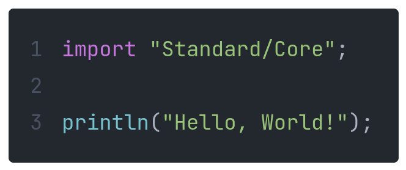
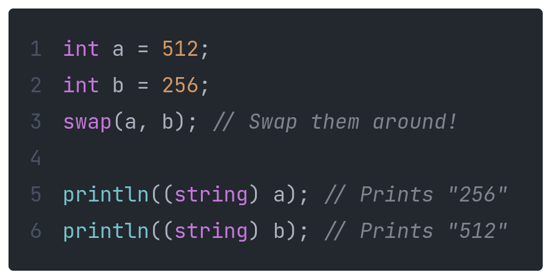
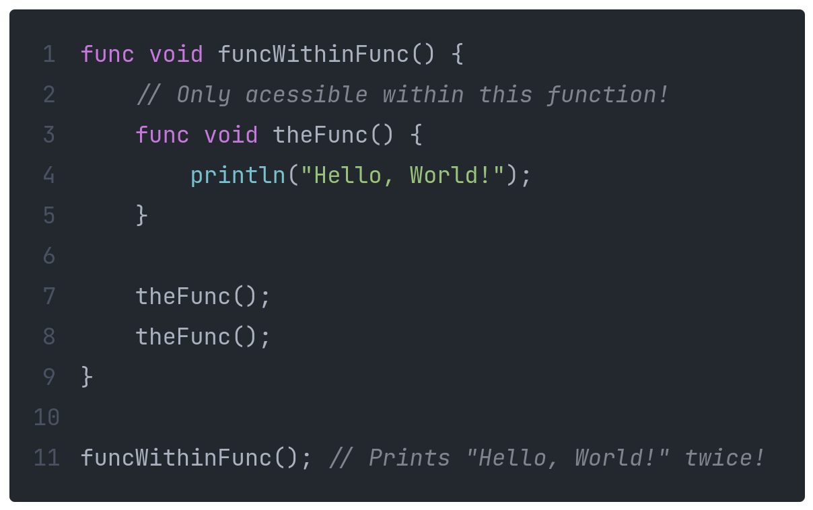
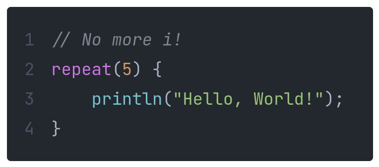
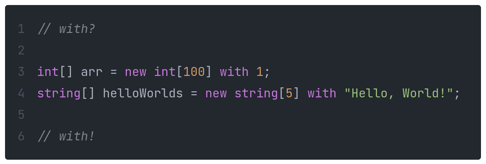

*Scope* is an interpreted, object oriented programming language that I am in the process of creating.



## Cool Features

*Temporary variables are boring...*



*Function bloat...*



*I don't need `i`...* (temporarily disabled)



*Initilizing an array is annoying...*



## Installation

```bash
# Clone!
$ git clone https://github.com/EliteAsian123/Scope.git

# If you don't have these installed
$ sudo apt install gcc
$ sudo apt install flex
$ sudo apt install bison
```

## Building

> **Note**
>
> Make sure to remove `example.c` from the `c_escape` submodule as it could cause problems.

```bash
# These warnings are normal
$ sh build.sh
src/scope.y: warning: 1 shift/reduce conflict [-Wconflicts-sr]
src/output/scope.tab.c: In function ‘yyparse’:
src/output/scope.tab.c:1486:16: warning: implicit declaration of function ‘yylex’ [-Wimplicit-function-declaration]
 1486 |       yychar = yylex ();
      |                ^~~~~
```

## Testing

```bash
$ sh tests.sh
Testing `Tests/Arrays.scope`
Testing `Tests/Floats.scope`
Testing `Tests/For.scope`
...
Done!
```